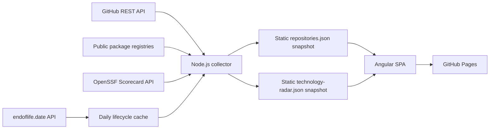

# Repo Control Center

[](https://github.com/rodri-oliveira-dev/repo-status-dashboard/actions/workflows/ci.yml)
[](https://github.com/rodri-oliveira-dev/repo-status-dashboard/actions/workflows/deploy-pages.yml)
[](https://github.com/rodri-oliveira-dev/repo-status-dashboard/actions/workflows/release.yml)
[](LICENSE)
[](https://angular.dev/)
[](https://www.typescriptlang.org/)
[](https://nodejs.org/)

English | [Português (Brasil)](README.pt-BR.md)

Repo Control Center is a read-only operational dashboard for the public repositories owned by
[rodri-oliveira-dev](https://github.com/rodri-oliveira-dev). It consolidates build, delivery,
release, activity, security, package, and health signals into a single portfolio view.

**[Live dashboard](https://rodri-oliveira-dev.github.io/repo-status-dashboard/)**

The application has no permanent backend. GitHub Actions runs a Node.js collector, produces a
static JSON snapshot, and publishes an Angular SPA to GitHub Pages. Credentials remain in the
Actions environment and are never sent to the browser.

## Features

- Monitors only public, owner-managed, non-fork, non-archived repositories.
- Shows the latest primary CI result from each repository's default branch.
- Separates CI, quality, security, mutation, delivery, release, Pages, and maintenance workflows.
- Classifies project type from repository structure and project metadata.
- Tracks commits, workflow runs, releases, deployments, issues, and pull requests.
- Reports release and delivery frequency with explicit source coverage.
- Presents security signals without a misleading composite score.
- Resolves verified npm and NuGet identities and public registry metrics.
- Explains Health through deterministic reason codes and a prioritized Needs Attention view.
- Supports search, filters, sorting, portfolio insights, and repository detail pages.

## Architecture



The scheduled Pages workflow runs the collector before building the application. The generated
snapshot is included in the Pages artifact; it is not committed automatically. This keeps data
collection out of the browser and avoids a continuously running service.

## Technology Radar

The <code>#/technology-radar</code> view inventories technology versions across the portfolio and
keeps technology health independent from operational repository Health. It provides explicitly
scoped portfolio indicators, a searchable and sortable inventory, evidence drill-down, Migration
Watch, and a chronological EOL calendar. Repository detail pages reuse the same snapshot in their
Technology Stack section and link in both directions.

The collector reuses each repository tree and downloads only relevant evidence files. Detection is
currently implemented for:

| Technology | Category     | Evidence                                                                                                                                             |
| ---------- | ------------ | ---------------------------------------------------------------------------------------------------------------------------------------------------- |
| .NET       | Runtime/tool | <code>.csproj</code>, <code>global.json</code>, and inherited <code>Directory.Build.props/targets</code> properties; SDK evidence is a separate tool |
| Node.js    | Runtime      | <code>.nvmrc</code>, <code>.node-version</code>, <code>package.json</code> engines, and workflow setup                                               |
| Angular    | Framework    | <code>@angular/core</code> declarations and resolved <code>package-lock.json</code> entries                                                          |
| TypeScript | Tool         | <code>typescript</code> declarations and resolved <code>package-lock.json</code> entries                                                             |

A **declared** version comes directly from a manifest; a **resolved** version is pinned by a
lockfile or a safely resolved central property; a **range** expresses compatibility rather than an
installed version; and **inferred** evidence is retained only when its provenance is explicit.
Multiple and conflicting versions are preserved. Test/example paths and development dependencies
are marked separately. Invalid files, unresolved properties, and truncated trees degrade
technology coverage without stopping portfolio collection.

Lifecycle is evaluated by pure rules in
[scripts/technology-lifecycle.mjs](scripts/technology-lifecycle.mjs). The beta endoflife.date v1
contract is isolated in a validating adapter. <code>Active</code> means active support has not
ended; <code>Maintenance</code> means active support ended but EOL has not; <code>End of Life</code>
means the published EOL date passed; and absent or unmatched information remains
<code>Unknown</code>. LTS is separate and can be Yes, No, Unknown, or Not applicable.

Migration urgency uses published EOL dates only: passed dates require migration, 0–90 days are
approaching, 91–180 days are monitored, more than 180 days need no immediate action, and absent
dates remain unknown. The thresholds are serialized in the snapshot and tested. Being behind the
latest release alone never makes a version obsolete, and no target version is recommended without
verified compatibility evidence.

Lifecycle references are refreshed at most once per 24 hours per product and restored through the
GitHub Actions cache. Each product retains its own retrieval time, including when a different
product refreshes successfully. The operational hourly collector reads only the local cache; the
refresh step independently retries products with attempts at least 24 hours old. A failed refresh
reuses valid prior data; stale data is identified, while a missing
source yields Unknown. The browser is read-only, receives no tokens, and makes no lifecycle calls.

The separate <code>technology-radar.json</code> snapshot avoids coupling the operational schema and
lets the main dashboard load without lifecycle data. To add a detector, extend the pure detector
registry in [scripts/technology-detection.mjs](scripts/technology-detection.mjs), add narrow evidence
paths, emit typed evidence without executing repository code, and cover it with local fixtures.

## Technology

- Angular 22 with standalone components, Signals, strict templates, and hash-based routing
- TypeScript 6 in strict mode
- SCSS with responsive light and dark themes
- Node.js 24 for development, collection, testing, and builds
- Vitest and Node's built-in test runner
- ESLint and Prettier
- GitHub Actions and GitHub Pages
- Angular automatic CSP generation plus build-time CSP hardening
- Lighthouse CI, SEO validation, IndexNow, and OWASP ZAP Baseline

## How collection works

[scripts/collect-github-status.mjs](scripts/collect-github-status.mjs) lists repositories for the
configured owner and explicitly excludes private repositories, forks, archived repositories, and
repositories owned by another account. The default concurrency is four repositories and can be set
from 1 to 8 with <code>COLLECTOR_CONCURRENCY</code>.

For each included repository, the collector reuses paginated GitHub data to gather:

- default-branch commits and repository metadata;
- workflow runs from GitHub Actions;
- deployments and each deployment's latest status;
- published GitHub Releases;
- open issues and pull requests;
- Dependabot and code-scanning alert counts;
- public OpenSSF Scorecard evidence;
- repository structure and package metadata.

Expected absence is not treated as an error. Optional API <code>404</code> responses and
<code>409</code> responses for empty repositories produce empty evidence. Permission errors,
unexpected client errors, network failures, and server errors make the affected signal group
unavailable. Transient network and server failures receive one retry. Warnings are sanitized before
they are logged or added to the snapshot.

### Collection coverage

Coverage is calculated for eight signal groups: metadata, commits, Actions, deployments, releases,
work items, security, and packages. Its states are <code>complete</code>, <code>partial</code>, and
<code>unavailable</code>. The internal <code>collection.confidence</code> field remains for schema
compatibility, but it represents source coverage—not confidence that every semantic classification
is correct. The UI therefore uses wording such as <code>8/8 signal groups collected</code>.

Missing observability never becomes a repository failure by itself. Partial collection adds context
to Health, while unavailable operational signals remain distinguishable from real CI or delivery
failures.

### Work items

Issues and pull requests are counted separately. An open item is stale after more than 30 days
without an update; an item exactly at the boundary is not stale. Closed issues and merged pull
requests are excluded. The snapshot retains counts and the three oldest stale items of each type.

## Workflow classification and Build

Pure classification rules live in
[scripts/github-status-rules.mjs](scripts/github-status-rules.mjs). Workflows are assigned one of
these roles:

- <code>ci</code>: primary integration, build, and code-validation pipelines;
- <code>quality</code>: Sonar, Codecov, coverage, isolated lint, Lighthouse, quality gates, and
  auxiliary validation;
- <code>security</code>: CodeQL, dependency review, secret scanning, OWASP ZAP, Trivy, Snyk, and
  equivalent scans;
- <code>mutation</code>: mutation-testing pipelines;
- <code>delivery</code>: explicit deployment or package/image publication;
- <code>release</code>: release or tag creation and publication;
- <code>pages</code>: GitHub Pages build or deployment;
- <code>maintenance</code>: Dependabot, Renovate, stale, cleanup, and synchronization automation;
- <code>unknown</code>: insufficient evidence.

Specific signals take precedence over generic words. For example, <code>Terraform CI</code> is CI,
<code>Lighthouse CI</code> is quality, and a package or release reference alone does not imply
delivery. <code>Validate</code>, <code>Validate .NET</code>, <code>Validate profile</code>,
supported primary validation workflows, and ingestion integration pipelines are CI. Version,
release, template, governance, package, metadata, and configuration validation remain auxiliary
quality checks.

Build uses only runs classified as <code>ci</code> whose <code>head_branch</code> equals the
repository's <code>default_branch</code>. A newer pull-request or feature-branch run cannot replace
the operational state of the default branch. If no default-branch CI run exists, Build is
<code>unknown</code>. Runs from other branches remain available to activity and historical metrics.
CI success rate includes only workflows classified as CI; quality, security, mutation, delivery,
and maintenance runs are excluded.

### Repository overrides

A repository can make workflow roles explicit with a root-level
<code>.repo-dashboard.yml</code>:

```yaml
workflows:
  ci:
    - ci.yml
    - build.yml
  quality: [sonar.yml, mutation-tests.yml]
  security: [codeql.yml]
  delivery: [publish.yml]
  release: [release.yml]
  pages: [deploy-pages.yml]
```

Supported roles are <code>ci</code>, <code>quality</code>, <code>security</code>,
<code>mutation</code>, <code>delivery</code>, <code>release</code>, <code>pages</code>, and
<code>maintenance</code>. Entries must be workflow file names ending in <code>.yml</code> or
<code>.yaml</code>. A configured role is authoritative: files omitted from that role are not
heuristically classified into it. Roles absent from the configuration continue to use semantic
discovery. Invalid configuration produces a repository-scoped warning and does not stop collection.

## Project types

Project Type favors structural evidence over descriptions and topics:

- <code>Angular</code>: a root <code>angular.json</code>;
- <code>Infrastructure</code>: Terraform files predominate over implementation files;
- <code>Documentation</code>: the universal profile pattern <code>&lt;owner&gt;/&lt;owner&gt;</code>
  or a documentation-only structure;
- <code>Template</code>: GitHub template metadata, <code>.template.config/template.json</code>, or a
  clear template/starter/boilerplate/seed identity;
- <code>Sample</code>: clear sample, example, demo, or proof-of-concept identity;
- <code>Analyzer</code>: Roslyn/analyzer project evidence;
- <code>CLI</code>: <code>PackAsTool</code> or <code>ToolCommandName</code> in a production
  <code>.csproj</code>;
- <code>Library</code>: a packable, non-executable production <code>.csproj</code> with an explicit
  <code>PackageId</code>;
- <code>Tool</code>: command files under <code>bin/</code> or a root GitHub Action manifest;
- <code>Application</code>: fallback when a language exists but no stronger structure is present;
- <code>Unknown</code>: no sufficient evidence.

Descriptions containing terms such as SDK, package, NuGet, or library do not classify a repository
as a Library by themselves. Test, sample, benchmark, evaluation, and fixture projects are excluded
when production <code>.csproj</code> evidence is evaluated.

## Delivery, activity, and portfolio insights

The current delivery signal uses this precedence:

1. a GitHub deployment and its latest status;
2. the latest workflow classified as delivery, release, or Pages;
3. the latest published, non-draft GitHub Release;
4. <code>None</code> when no evidence exists.

Delivery type can be NuGet, npm, GitHub Pages, GitHub Release, Container, Deployment, Terraform,
None, or Unknown. A version is shown only when a tag, reference, or title contains a reliable
semantic version, or when a release is published within 30 minutes of the delivery signal.

The 30-day activity window is recomputed for every snapshot. Zero means the source was queried and
contained no matching events; <code>null</code> means the source was unavailable. Workflow runs
from pull requests and non-default branches count toward general activity and may contribute to
historical CI metrics, but they never replace Build.

Release frequency counts published, non-draft GitHub Releases. Delivery frequency counts only:

- deployments whose final status is <code>success</code> or an equivalent positive state;
- successful workflows classified as delivery, release, or Pages;
- published, non-draft GitHub Releases.

Failed, cancelled, queued, or in-progress deployments are excluded. Evidence from different sources
within 30 minutes is correlated into one delivery event; distinct events from the same source are
not collapsed. If any required source is unavailable, delivery frequency is unavailable instead of
publishing a numeric undercount.

Portfolio Insights uses the same snapshot and window. Active repositories have at least one
observed commit, workflow, release, or deployment. CI success rate is successful CI runs divided by
successful plus failed CI runs. Release and delivery totals include only repositories with
available sources and display their coverage. The staleness watch distinguishes repositories
between 60 and 90 days without a commit from those already beyond the 90-day Health threshold.
These metrics are observed counts, not a DORA certification or a historical trend series.

## Health

Health is deterministic and uses available operational evidence in this order:

1. <code>Failed</code> when default-branch CI or the current delivery failed;
2. <code>Stale</code> when significant activity is older than 90 days;
3. <code>Healthy</code> when default-branch CI passed and activity is recent;
4. <code>Warning</code> for running, queued, cancelled, or partially known operational states;
5. <code>Unknown</code> when CI and delivery cannot be determined.

The collector does not include archived repositories, so Archived is not part of the displayed
portfolio. Health reason codes preserve the distinction between operational failures and
observability gaps. Needs Attention prioritizes critical failures, warnings, and stale work; an
informational collection warning alone does not place a repository in that queue.

The stale repository threshold is 90 days. The stale work-item threshold is 30 days.

## Security posture

Security posture presents separate evidence rather than a composite security score:

- Dependabot and code-scanning states and aggregate open-alert counts;
- high/critical code-scanning counts;
- the latest recognized security workflow status;
- the public OpenSSF Scorecard result.

The snapshot never serializes dependency names, CVEs, source paths, code excerpts, or credentials.
States such as <code>clean</code>, <code>findings_present</code>, <code>disabled</code>,
<code>not_configured</code>, and <code>unavailable</code> distinguish findings, setup, and
observability. Only high/critical counts enter Needs Attention.

The published site is also checked by
[owasp-zap.yml](.github/workflows/owasp-zap.yml). Its passive baseline scan is restricted to the
dashboard path. [rules.tsv](.zap/rules.tsv) downgrades hosting-controlled header/cache findings to
informational, and [hooks.py](.zap/hooks.py) removes findings from sibling sites on the shared Pages
host while retaining documented CSP exceptions.

## Package metrics

An npm identity is accepted only when a public, non-private <code>package.json</code> declares both
a name and repository metadata that exactly matches the collected GitHub repository. A NuGet
identity is accepted only when a production <code>.csproj</code> declares both
<code>PackageId</code> and a matching <code>RepositoryUrl</code>. Package IDs are never inferred
from repository names.

Verified packages are resolved through the public npm and NuGet registries. npm exposes the latest
version and last-month downloads with period dates. NuGet exposes the current version and lifetime
<code>totalDownloads</code>. Missing manifests produce <code>none</code>; incomplete or mismatched
metadata produces <code>ambiguous</code>; external failures produce <code>partial</code> or
<code>unavailable</code>. Registry download metrics have different scopes and should not be
compared directly across ecosystems.

## Local development

Requirements: Node.js 24 and npm.

```bash
npm ci
npm start
```

Open <http://localhost:4200>. The committed
[public/data/repositories.json](public/data/repositories.json) snapshot supports UI development
without running the collector. The committed empty
[public/data/technology-radar.json](public/data/technology-radar.json) is the offline baseline; the
collector replaces it with real detected data.

Useful commands:

```bash
npm run collect       # Refresh the snapshot from public GitHub data
npm run lifecycle:refresh        # Refresh lifecycle data only when older than 24 hours
npm run lifecycle:refresh:force  # Force-refresh verified lifecycle references
npm run format:check  # Check Prettier formatting
npm run lint          # Lint TypeScript, templates, and scripts
npm test              # Run Angular and collector tests
npm run build         # Build the production application
npm run build:pages   # Build with the repository Pages base href
```

## GitHub Pages and automation

[deploy-pages.yml](.github/workflows/deploy-pages.yml) runs on pushes to <code>main</code>, on manual
dispatch, and hourly at minute 17. It collects data, checks formatting, lints, tests, builds with the
repository base href, and deploys the official Pages artifact. The lifecycle cache restores the
newest saved revision and saves a new run-specific key only if the file changed. This avoids
pinning an old revision under an immutable daily key.

Repository routes use hashes, for example <code>#/repository/repo-status-dashboard</code>, so direct
refresh does not require server rewrites. The canonical indexable URL is:

<https://rodri-oliveira-dev.github.io/repo-status-dashboard/>

Additional automation includes:

- [ci.yml](.github/workflows/ci.yml): format, lint, tests, build, and security configuration checks;
- [seo-validation.yml](.github/workflows/seo-validation.yml): canonical metadata, structured data,
  sitemap, and personal-site backlink validation;
- [lighthouse.yml](.github/workflows/lighthouse.yml): three local Lighthouse runs with enforced
  accessibility, best-practices, and SEO budgets; performance remains advisory;
- [indexnow.yml](.github/workflows/indexnow.yml): submits the canonical URL after successful
  deployment, on demand, and through a daily fallback;
- [owasp-zap.yml](.github/workflows/owasp-zap.yml): passive scan after eligible deployments, on
  demand, and weekly;
- [release.yml](.github/workflows/release.yml): manual validated releases from <code>main</code>.

## Configuration

| Variable                           | Purpose                                                       |
| ---------------------------------- | ------------------------------------------------------------- |
| <code>GH_DASHBOARD_TOKEN</code>    | Preferred server-side token for higher public API coverage    |
| <code>GITHUB_TOKEN</code>          | Fallback token, including the ephemeral Actions token         |
| <code>GITHUB_OWNER</code>          | Owner to collect; defaults to <code>rodri-oliveira-dev</code> |
| <code>COLLECTOR_CONCURRENCY</code> | Parallel repository limit from 1 to 8; defaults to 4          |

Collection can run without a token under GitHub's anonymous public rate limit. A read-only
fine-grained token can improve rate limits and access to public Actions, deployments, and security
signals across the owner's repositories. Authentication does not enable private-repository support:
private repositories are always filtered out. Tokens are never serialized, logged, or sent to the
SPA.

## Current limitations

- GitHub does not always expose an unambiguous relationship between a workflow and a published
  version; the version remains empty when correlation is not reliable.
- Unrecognized workflow naming can result in <code>unknown</code>; repository overrides are
  available for intentional exceptions.
- The repository's ephemeral <code>GITHUB_TOKEN</code> may not read Actions, deployments, or
  security data from other public repositories. A read-only token may be required for full signal
  coverage.
- Anonymous GitHub API limits are low for owners with many repositories.
- Package and OpenSSF metrics depend on external public APIs and their cache/update policies.
- TypeScript has no configured lifecycle product because no verified LTS/EOL policy is available;
  its lifecycle remains Unknown/Not applicable. Only npm lockfile resolution is currently
  implemented; Yarn and pnpm files are discovery evidence but are not parsed yet.
- Conditional or custom MSBuild evaluation is intentionally not executed. Only statically
  resolvable properties are used, and unsupported repository layouts may reduce coverage.
- GitHub Pages controls some response headers; the ZAP policy keeps those hosting-level findings
  informational.
- Repository detail pages use hash routes; search engines index the dashboard root rather than one
  server-rendered page per repository.

Private repositories, forks, and archived repositories are intentionally out of scope.

## Project structure

```text
src/app/core/                 snapshot loading and theme services
src/app/features/             dashboard, Technology Radar, and repository detail features
src/app/shared/               models, components, pipes, filters, and insights
public/data/repositories.json committed snapshot consumed by the SPA
public/data/technology-radar.json offline Technology Radar snapshot
public/data/lifecycle-cache.json verified external lifecycle cache
scripts/                      collector, semantic rules, and build utilities
.github/workflows/            CI, Pages, release, quality, SEO, and security automation
```

## Releases

[release.yml](.github/workflows/release.yml) is manually dispatched from <code>main</code> with a
<code>vX.Y.Z</code> version. It validates the version, checks for an existing tag or release,
installs dependencies, runs formatting, lint, tests, and the Pages build, then creates:

- a Git tag and GitHub Release;
- a compressed static build artifact;
- a SHA-256 checksum.

The workflow can generate release notes and mark the release as a prerelease.

## License

This project is licensed under the [MIT License](LICENSE).
