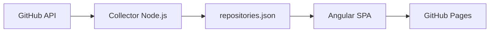

# Repo Control Center

Painel operacional, somente leitura, para acompanhar build, entrega, versão, atividade e saúde dos repositórios GitHub pertencentes a [`rodri-oliveira-dev`](https://github.com/rodri-oliveira-dev). A aplicação não mantém backend nem envia credenciais ao navegador.

> **Screenshot:** adicione aqui uma captura do dashboard publicado após o primeiro deploy.

## Arquitetura



O workflow agendado executa o collector durante o próprio job de publicação. O snapshot gerado entra no artifact do Pages e não exige commits automáticos.

## Stack

- Angular 22 com standalone components, Signals e templates estritos
- TypeScript 6 em modo strict
- SCSS responsivo com light/dark mode
- ESLint, Prettier, Vitest e `node:test`
- GitHub Actions e GitHub Pages
- Node.js 24 apenas para desenvolvimento, build e coleta

## Executar localmente

Requisitos: Node.js 24 e npm.

```bash
npm ci
npm start
```

Acesse `http://localhost:4200`. O snapshot versionado em `public/data/repositories.json` permite desenvolver a UI sem executar a coleta.

Comandos úteis:

```bash
npm run collect       # atualiza o snapshot pela API do GitHub
npm run lint          # ESLint para TypeScript, templates e scripts
npm test              # testes Angular e das regras do collector
npm run build         # build local de produção
npm run build:pages   # build com base href /repo-status-dashboard/
npm run format:check  # valida Prettier
```

## Collector

[`scripts/collect-github-status.mjs`](scripts/collect-github-status.mjs) lista apenas repositórios cujo owner é `rodri-oliveira-dev`, remove forks, pagina resultados e enriquece cada item com commits, workflow runs, deployments e release mais recente. A concorrência padrão é quatro; altere com `COLLECTOR_CONCURRENCY` entre 1 e 8.

O script usa `fetch` nativo e continua quando uma consulta opcional ou um único repositório falha. Avisos ficam no log e no campo opcional `warnings` do snapshot. O arquivo é ordenado por nome e formatado antes de ser salvo.

### Variáveis de ambiente

| Variável                | Uso                                            |
| ----------------------- | ---------------------------------------------- |
| `GH_DASHBOARD_TOKEN`    | Token preferencial do collector                |
| `GITHUB_TOKEN`          | Fallback, inclusive o token efêmero do Actions |
| `GITHUB_OWNER`          | Owner opcional; padrão `rodri-oliveira-dev`    |
| `COLLECTOR_CONCURRENCY` | Número de repositórios processados em paralelo |

Sem token, a coleta funciona com dados públicos e o limite anônimo da API. Para limites maiores ou eventual acesso a repositórios privados, configure o secret `GH_DASHBOARD_TOKEN` com um fine-grained PAT somente leitura, limitado aos repositórios necessários e às permissões de Contents, Actions e Deployments. O token nunca é serializado, enviado à SPA ou escrito nos logs.

## Regras de classificação

As regras puras e testáveis ficam em [`scripts/github-status-rules.mjs`](scripts/github-status-rules.mjs).

### Build

O collector procura o workflow mais recente cujo nome, título ou arquivo contenha `ci`, `build`, `test`, `quality` ou `validation`. Execuções atribuídas ao Dependabot são excluídas dessa escolha. O resultado é normalizado para `passing`, `failing`, `running`, `queued`, `cancelled` ou `unknown`.

### Delivery

A descoberta segue esta precedência:

1. deployment registrado no GitHub e seu status mais recente;
2. workflow de deploy/publicação/package;
3. GitHub Release mais recente;
4. `None` quando não há evidência.

O tipo é inferido como NuGet, npm, GitHub Pages, GitHub Release, Container, Deployment, Terraform, None ou Unknown. Uma versão só é exibida quando uma tag, referência ou título contém um valor confiável, ou quando uma release ocorreu em uma janela de 30 minutos da delivery; do contrário permanece `null` e a UI mostra `—`.

### Health

Precedência atual:

1. `Archived` para repositórios arquivados;
2. `Failed` quando CI ou delivery falhou;
3. `Stale` sem atividade significativa há mais de 90 dias;
4. `Healthy` para CI aprovado e atividade recente;
5. `Warning` para estados intermediários ou dados parcialmente conhecidos;
6. `Unknown` quando CI e delivery não podem ser determinados.

## GitHub Pages

O workflow [`deploy-pages.yml`](.github/workflows/deploy-pages.yml) roda no push para `main`, manualmente e a cada hora. Ele coleta dados, valida formato/lint/testes, deriva o `base href` do nome real do repositório e publica o artifact oficial do Pages.

No repositório GitHub, escolha **Settings → Pages → Source → GitHub Actions**. A URL esperada é:

```text
https://rodri-oliveira-dev.github.io/repo-status-dashboard/
```

As rotas usam hash (`#/repository/...`), evitando 404 em refresh sem exigir um servidor ou cópia de `404.html`.

## Atualização automática

O cron `17 * * * *` dispara aproximadamente uma vez por hora (o GitHub pode atrasar schedules em períodos de carga). Também é possível usar **Run workflow**. O JSON publicado reflete o instante do último workflow bem-sucedido.

## Limitações atuais

- A API pode não expor uma associação inequívoca entre um workflow e a versão publicada; nesses casos a versão fica vazia.
- Workflows com nomes fora das palavras-chave podem resultar em `unknown`.
- O `GITHUB_TOKEN` do próprio repositório pode não ler Actions/Deployments de outros repositórios; use o PAT somente leitura para cobertura completa.
- O limite anônimo da API é baixo para contas com muitos repositórios.
- Estatísticas externas e sinais de segurança não fazem parte desta primeira versão.

## Roadmap

- Codecov
- SonarCloud
- Dependabot alerts
- GitHub security alerts
- OpenSSF Scorecard
- NuGet package statistics
- npm statistics
- stale issues
- stale PRs
- repository activity trends
- release frequency
- deployment frequency

## Estrutura principal

```text
src/app/core/                 carregamento do snapshot e tema
src/app/features/             dashboard e detalhes do repositório
src/app/shared/               contrato, componentes, pipes e busca
public/data/repositories.json fixture/snapshot consumido pela SPA
scripts/                      collector e regras de classificação
.github/workflows/            CI e deploy agendado no Pages
```

## Segurança

A aplicação publicada consome somente o JSON estático. Não há token, chamada autenticada ao GitHub, OAuth, armazenamento de credenciais ou mutação de repositórios no frontend.
