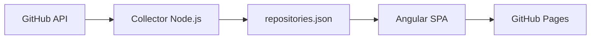

# Repo Control Center

O **Repo Control Center** é um dashboard operacional, somente leitura, para acompanhar em um único lugar o estado dos repositórios GitHub pertencentes a [`rodri-oliveira-dev`](https://github.com/rodri-oliveira-dev).

Ele consolida sinais que normalmente ficam espalhados entre repositórios, workflows, deployments e releases — como status de build, entrega, versão publicada, atividade recente e saúde geral — e transforma esses dados em uma visão centralizada para manutenção e tomada de decisão.

A aplicação não mantém backend permanente nem envia credenciais ao navegador. A coleta acontece no GitHub Actions, gera um snapshot JSON estático e publica a SPA no GitHub Pages.

## O que ele faz

O dashboard coleta e organiza automaticamente informações dos repositórios próprios da conta, ignorando forks, e apresenta:

- status do CI/build mais recente;
- status e tipo da última entrega;
- versão publicada, quando pode ser determinada com segurança;
- data do último commit e atividade recente;
- última GitHub Release;
- linguagem e tipo do projeto;
- quantidade de estrelas e total combinado de issues e pull requests abertos;
- classificação de saúde do repositório;
- filtros por saúde, tipo de projeto, tecnologia e tipo de entrega;
- busca por repositório;
- ordenação por nome, atualização ou saúde;
- visão detalhada de cada repositório;
- identificação separada de projetos arquivados.

O objetivo não é substituir o GitHub, mas funcionar como uma camada de observabilidade do portfólio de repositórios.

## Ganhos

Centralizar esses sinais reduz a necessidade de abrir repositório por repositório para entender o estado do ecossistema.

Na prática, o dashboard ajuda a:

- **reduzir carga operacional**, concentrando informações dispersas em uma única tela;
- **identificar falhas rapidamente**, destacando builds ou entregas com problema;
- **encontrar projetos esquecidos**, classificando repositórios sem atividade recente como `Stale`;
- **acompanhar releases e deploys**, facilitando a identificação da última versão efetivamente entregue;
- **priorizar manutenção**, usando uma classificação de saúde uniforme entre projetos;
- **detectar inconsistências de automação**, como projetos sem workflow reconhecido ou sem evidência de delivery;
- **manter visão de portfólio**, útil quando a quantidade de repositórios cresce;
- **evitar infraestrutura adicional**, já que o resultado publicado é totalmente estático;
- **reduzir exposição de credenciais**, porque tokens existem apenas no contexto do GitHub Actions e nunca são enviados para a SPA.

## Arquitetura



O workflow agendado executa o collector durante o próprio job de publicação. O snapshot gerado entra no artifact do Pages e não exige commits automáticos.

Esse desenho mantém a solução simples: o GitHub Actions atua como processo de coleta, o JSON como snapshot de leitura e o GitHub Pages como camada de publicação.

## Stack

- Angular 22 com standalone components, Signals e templates estritos
- TypeScript 6 em modo strict
- SCSS responsivo com light/dark mode
- ESLint, Prettier, Vitest e `node:test`
- GitHub Actions e GitHub Pages
- Lighthouse CI para performance, acessibilidade, boas práticas e SEO
- IndexNow para notificar mecanismos de busca após publicação
- OWASP ZAP Baseline para validação passiva da Pages publicada
- Node.js 24 apenas para desenvolvimento, build e coleta

## SEO, qualidade e segurança da Pages

A página publicada é tratada também como uma vitrine técnica do portfólio. O HTML base inclui canonical URL, Open Graph, Twitter Cards, autoria e structured data com `WebSite`, `WebApplication` e `Person`. Um sitemap dedicado expõe a URL canônica do dashboard.

O workflow [`seo-validation.yml`](.github/workflows/seo-validation.yml) valida esses metadados, structured data, sitemap e o backlink para o site pessoal. O [`lighthouse.yml`](.github/workflows/lighthouse.yml), adaptado do site principal, executa três medições e aplica quality gates para SEO, boas práticas e acessibilidade, mantendo performance como warning.

O [`indexnow.yml`](.github/workflows/indexnow.yml) reutiliza a chave de propriedade já publicada pelo site pessoal no host `rodri-oliveira-dev.github.io` e envia a URL canônica do dashboard ao IndexNow após um deploy bem-sucedido, manualmente ou no fallback diário. Isso reduz a dependência de descoberta apenas por crawling e ajuda mudanças públicas a chegarem mais rapidamente aos mecanismos de busca compatíveis.

O workflow [`owasp-zap.yml`](.github/workflows/owasp-zap.yml) executa um OWASP ZAP Baseline passivo contra a GitHub Pages publicada após deploys originados por mudanças de código, manualmente e uma vez por semana. A ruleset [`rules.tsv`](.zap/rules.tsv) reclassifica como `INFO` findings de headers/cache controlados pelo GitHub Pages, enquanto [`hooks.py`](.zap/hooks.py) remove alerts de outros sites no mesmo host e somente exceções CSP documentadas (`10055-13` e `10055-6`). O Angular usa `security.autoCsp` para a política de scripts; o build complementa essa política com diretivas explícitas de recursos por meio de `scripts/harden-csp.mjs`. A issue do ZAP é gerenciada por um pós-processador próprio, evitando que o wrapper republique findings informativos ou de outros sites.

O logo do Repo Control Center aponta para [o site pessoal](https://rodri-oliveira-dev.github.io/), transformando o dashboard também em um ponto de entrada para o restante do portfólio.

## Executar localmente

Requisitos: Node.js 24 e npm.

```bash
npm ci
npm start
```

Acesse `http://localhost:4200`. O snapshot versionado em `public/data/repositories.json` permite desenvolver a UI sem executar a coleta.

Comandos úteis:

```bash
npm run collect       # atualiza o snapshot pela API do GitHub
npm run lint          # ESLint para TypeScript, templates e scripts
npm test              # testes Angular e das regras do collector
npm run build         # build local de produção
npm run build:pages   # build com base href /repo-status-dashboard/
npm run format:check  # valida Prettier
```

## Collector

[`scripts/collect-github-status.mjs`](scripts/collect-github-status.mjs) lista apenas repositórios cujo owner é `rodri-oliveira-dev`, remove forks, pagina resultados e enriquece cada item com commits, workflow runs, deployments e release mais recente. A concorrência padrão é quatro; altere com `COLLECTOR_CONCURRENCY` entre 1 e 8.

O script usa `fetch` nativo e continua quando uma consulta opcional ou um único repositório falha. Avisos ficam no log e no campo opcional `warnings` do snapshot. O arquivo é ordenado por nome e formatado antes de ser salvo.

### Variáveis de ambiente

| Variável                | Uso                                            |
| ----------------------- | ---------------------------------------------- |
| `GH_DASHBOARD_TOKEN`    | Token preferencial do collector                |
| `GITHUB_TOKEN`          | Fallback, inclusive o token efêmero do Actions |
| `GITHUB_OWNER`          | Owner opcional; padrão `rodri-oliveira-dev`    |
| `COLLECTOR_CONCURRENCY` | Número de repositórios processados em paralelo |

Sem token, a coleta funciona com dados públicos e o limite anônimo da API. Para limites maiores ou eventual acesso a repositórios privados, configure o secret `GH_DASHBOARD_TOKEN` com um fine-grained PAT somente leitura, limitado aos repositórios necessários e às permissões de Contents, Actions e Deployments. O token nunca é serializado, enviado à SPA ou escrito nos logs.

## Regras de classificação

As regras puras e testáveis ficam em [`scripts/github-status-rules.mjs`](scripts/github-status-rules.mjs).

### Build

O collector procura o workflow mais recente cujo nome, título ou arquivo contenha `ci`, `build`, `test`, `quality` ou `validation`. Execuções atribuídas ao Dependabot são excluídas dessa escolha. O resultado é normalizado para `passing`, `failing`, `running`, `queued`, `cancelled` ou `unknown`.

### Delivery

A descoberta segue esta precedência:

1. deployment registrado no GitHub e seu status mais recente;
2. workflow de deploy/publicação/package;
3. GitHub Release mais recente;
4. `None` quando não há evidência.

O tipo é inferido como NuGet, npm, GitHub Pages, GitHub Release, Container, Deployment, Terraform, None ou Unknown. Uma versão só é exibida quando uma tag, referência ou título contém um valor confiável, ou quando uma release ocorreu em uma janela de 30 minutos da delivery; do contrário permanece `null` e a UI mostra `—`.

### Health

Precedência atual:

1. `Archived` para repositórios arquivados;
2. `Failed` quando CI ou delivery falhou;
3. `Stale` sem atividade significativa há mais de 90 dias;
4. `Healthy` para CI aprovado e atividade recente;
5. `Warning` para estados intermediários ou dados parcialmente conhecidos;
6. `Unknown` quando CI e delivery não podem ser determinados.

A classificação cria uma linguagem comum para interpretar rapidamente o estado dos projetos, sem depender de convenções visuais diferentes em cada repositório.

## GitHub Pages

O workflow [`deploy-pages.yml`](.github/workflows/deploy-pages.yml) roda no push para `main`, manualmente e a cada hora. Ele coleta dados, valida formato/lint/testes, deriva o `base href` do nome real do repositório e publica o artifact oficial do Pages.

No repositório GitHub, escolha **Settings → Pages → Source → GitHub Actions**. A URL esperada é:

```text
https://rodri-oliveira-dev.github.io/repo-status-dashboard/
```

As rotas usam hash (`#/repository/...`), evitando 404 em refresh sem exigir um servidor ou cópia de `404.html`.

## Atualização automática

O cron `17 * * * *` dispara aproximadamente uma vez por hora (o GitHub pode atrasar schedules em períodos de carga). Também é possível usar **Run workflow**. O JSON publicado reflete o instante do último workflow bem-sucedido.

Essa atualização periódica mantém o dashboard próximo do estado real dos repositórios sem exigir polling contínuo no navegador nem chamadas autenticadas feitas pelo usuário.

## Limitações atuais

- A API pode não expor uma associação inequívoca entre um workflow e a versão publicada; nesses casos a versão fica vazia.
- Workflows com nomes fora das palavras-chave podem resultar em `unknown`.
- O `GITHUB_TOKEN` do próprio repositório pode não ler Actions/Deployments de outros repositórios; use o PAT somente leitura para cobertura completa.
- O limite anônimo da API é baixo para contas com muitos repositórios.
- Os detalhes de repositório usam hash routes; para mecanismos de busca, a URL indexável principal é a raiz do dashboard.
- Alguns headers de segurança são controlados pela infraestrutura do GitHub Pages; esses casos são explicitamente reclassificados como `INFO` na ruleset do ZAP para não poluir o relatório acionável do dashboard.

## Roadmap

- Codecov
- SonarCloud
- Dependabot alerts
- GitHub security alerts
- OpenSSF Scorecard
- NuGet package statistics
- npm statistics
- stale issues
- stale PRs
- repository activity trends
- release frequency
- deployment frequency

## Estrutura principal

```text
src/app/core/                 carregamento do snapshot e tema
src/app/features/             dashboard e detalhes do repositório
src/app/shared/               contrato, componentes, pipes e busca
public/data/repositories.json fixture/snapshot consumido pela SPA
scripts/                      collector e regras de classificação
.github/workflows/            CI, SEO, Lighthouse, segurança e deploy
```

## Segurança

A aplicação publicada consome somente o JSON estático. Não há token, chamada autenticada ao GitHub, OAuth, armazenamento de credenciais ou mutação de repositórios no frontend.

A autenticação necessária para enriquecer os dados fica restrita ao ambiente controlado do GitHub Actions. Isso permite publicar o dashboard como site estático sem transformar o navegador em cliente privilegiado da API do GitHub.

Além da segurança por desenho, a Pages publicada recebe validação dinâmica periódica com OWASP ZAP Baseline. O scan é restrito ao subdiretório do dashboard e diferencia findings controláveis pela aplicação daqueles pertencentes à camada de hospedagem do GitHub Pages. Para scripts, o build Angular usa `security.autoCsp`, evitando uma política estática com nonce reutilizável. Alertas CSP permanecem acionáveis no ZAP justamente para detectar regressões na política gerada.

## Releases

O workflow manual [`release.yml`](.github/workflows/release.yml) valida formato, lint, testes e build antes de criar uma tag e uma GitHub Release. Execute **Actions → Create Release → Run workflow** a partir de `main` e informe uma versão no formato `vX.Y.Z`. A release inclui o build estático compactado e seu checksum SHA-256.

## Licença

Copyright © 2026 Rodrigo de Oliveira. Todos os direitos reservados. Este projeto é proprietário e não concede permissão para usar, copiar, modificar ou redistribuir o código sem autorização prévia por escrito. Consulte [`LICENSE`](LICENSE).
