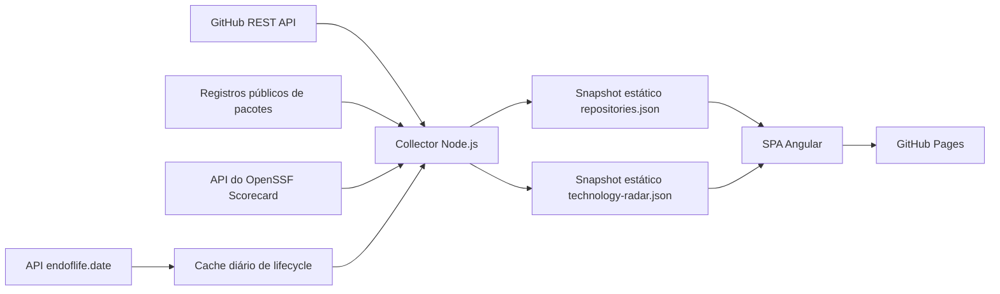

# Repo Control Center

[](https://github.com/rodri-oliveira-dev/repo-status-dashboard/actions/workflows/ci.yml)
[](https://github.com/rodri-oliveira-dev/repo-status-dashboard/actions/workflows/deploy-pages.yml)
[](https://github.com/rodri-oliveira-dev/repo-status-dashboard/actions/workflows/release.yml)
[](LICENSE)
[](https://angular.dev/)
[](https://www.typescriptlang.org/)
[](https://nodejs.org/)

[English](README.md) | Português (Brasil)

O Repo Control Center é um dashboard operacional, somente leitura, para os repositórios públicos
pertencentes a [rodri-oliveira-dev](https://github.com/rodri-oliveira-dev). Ele consolida sinais de
build, delivery, release, atividade, segurança, pacotes e health em uma única visão de portfólio.

**[Dashboard publicado](https://rodri-oliveira-dev.github.io/repo-status-dashboard/)**

A aplicação não possui backend permanente. O GitHub Actions executa um collector em Node.js, gera
um snapshot JSON estático e publica uma SPA Angular no GitHub Pages. As credenciais permanecem no
ambiente do Actions e nunca são enviadas ao navegador.

## Funcionalidades

- Monitora somente repositórios públicos, próprios, não-forks e não-arquivados.
- Exibe o resultado do CI primário mais recente na default branch de cada repositório.
- Separa workflows de CI, quality, security, mutation, delivery, release, Pages e maintenance.
- Classifica o tipo do projeto pela estrutura do repositório e pelos metadados dos projetos.
- Acompanha commits, workflow runs, releases, deployments, issues e pull requests.
- Informa frequências de release e delivery com cobertura explícita das fontes.
- Apresenta sinais de segurança sem produzir um score composto enganoso.
- Resolve identidades npm e NuGet verificadas e métricas dos registros públicos.
- Explica Health por reason codes determinísticos e uma visão priorizada de Needs Attention.
- Oferece busca, filtros, ordenação, Portfolio Insights e detalhes por repositório.

## Arquitetura



O workflow agendado do Pages executa o collector antes do build da aplicação. O snapshot gerado é
incluído no artifact do Pages e não é commitado automaticamente. Assim, a coleta permanece fora do
navegador e não exige um serviço em execução contínua.

## Technology Radar

A visão <code>#/technology-radar</code> inventaria versões de tecnologias no portfólio e mantém
Technology Health independente do Health operacional dos repositórios. Ela oferece indicadores com
escopo explícito, inventário pesquisável e ordenável, detalhamento de evidências, Migration Watch e
calendário cronológico de EOL. Os detalhes do repositório reutilizam o mesmo snapshot na seção
Technology Stack, com navegação nos dois sentidos.

O collector reutiliza a árvore de cada repositório e baixa somente arquivos de evidência
relevantes. A detecção atual inclui:

| Tecnologia | Categoria    | Evidências                                                                                                                                                       |
| ---------- | ------------ | ---------------------------------------------------------------------------------------------------------------------------------------------------------------- |
| .NET       | Runtime/tool | <code>.csproj</code>, <code>global.json</code> e propriedades herdadas de <code>Directory.Build.props/targets</code>; evidência de SDK é uma ferramenta separada |
| Node.js    | Runtime      | <code>.nvmrc</code>, <code>.node-version</code>, engines do <code>package.json</code> e workflows                                                                |
| Angular    | Framework    | declarações de <code>@angular/core</code> e entradas resolvidas do <code>package-lock.json</code>                                                                |
| TypeScript | Tool         | declarações de <code>typescript</code> e entradas resolvidas do <code>package-lock.json</code>                                                                   |

Os target frameworks .NET são classificados por família antes da avaliação de lifecycle. Targets
modernos <code>net8.0</code>/<code>net10.0</code> são runtimes .NET, targets
<code>netcoreapp</code> são runtimes .NET Core, targets compactos
<code>net48</code>/<code>net481</code> são .NET Framework e
<code>netstandard2.0</code>/<code>netstandard2.1</code> são especificações de compatibilidade de API
.NET Standard. .NET Standard nunca recebe o EOL de um runtime. Famílias sem política de ciclo
diretamente aplicável e verificável permanecem Unknown, com LTS Not applicable. Os TFMs originais
continuam nas evidências, inclusive todos os targets de projetos multitarget; a evidência de SDK em
<code>global.json</code> continua como uma tecnologia .NET SDK separada.

Uma versão **declarada** vem diretamente do manifesto; uma versão **resolvida** é fixada por um
lockfile ou propriedade central resolvida com segurança; uma **faixa** expressa compatibilidade, não
uma instalação; e evidência **inferida** só é mantida com origem explícita. Versões múltiplas e
conflitantes são preservadas. Caminhos de testes/exemplos e dependências de desenvolvimento são
marcados separadamente. Arquivos inválidos, propriedades não resolvidas e árvores truncadas reduzem
a cobertura tecnológica sem interromper a coleta do portfólio.

O inventário e o gráfico consolidam versões somente quando Major representa um ciclo de lifecycle
significativo: .NET SDK, .NET moderno, Node.js, Angular e TypeScript. Ocorrências Declared,
Resolved e Range continuam disponíveis individualmente em Evidence, enquanto cada repositório é
contado uma vez por ciclo consolidado. .NET Core e .NET Standard mantêm ciclos Major.Minor, e .NET
Framework mantém a versão completa do framework. Um range SemVer só recebe uma Major quando todas
as versões permitidas pertencem inequivocamente à mesma Major; ranges amplos ou não suportados
permanecem explicitamente não classificados. Assim, versão detectada é o valor exato da fonte, e
versão consolidada é o ciclo seguro usado na visualização do portfólio.

A matriz tecnológica responsiva aparece antes da tabela detalhada. Seus grupos organizam
plataformas, frameworks, linguagens e ferramentas, e infraestrutura sem sobrepor rótulos. Cada card
mostra versão consolidada, categoria exata, quantidade de repositórios distintos e a urgência de
migração baseada no lifecycle em texto: Sem ação imediata, Monitorar, Migração próxima, Migração
necessária ou Unknown. Essas classificações não são decisões Adopt/Trial/Assess/Hold, e Unknown
nunca é tratado como seguro. Selecione um card ou uma linha da tabela por mouse ou teclado para
abrir Evidence e mover o foco até ela; versões exatas, proveniência, escopo, confiança, arquivos de
origem e links de repositório continuam disponíveis no painel. Os filtros do inventário se aplicam
de forma consistente à matriz e à tabela.

O lifecycle é avaliado por regras puras em
[scripts/technology-lifecycle.mjs](scripts/technology-lifecycle.mjs). O contrato beta v1 do
endoflife.date fica isolado em um adaptador com validação. <code>Active</code> indica que o suporte
ativo não terminou; <code>Maintenance</code>, que o suporte ativo terminou mas o EOL não;
<code>End of Life</code>, que a data publicada de EOL passou; e informação ausente ou sem
correspondência permanece <code>Unknown</code>. LTS é separado e pode ser Sim, Não, Desconhecido ou
Não aplicável.

A urgência usa somente datas publicadas de EOL: datas vencidas exigem migração, 0–90 dias indicam
migração próxima, 91–180 dias exigem monitoramento, mais de 180 dias não requerem ação imediata, e
datas ausentes permanecem desconhecidas. Os limites são serializados e testados. Estar abaixo da
última versão não torna uma linha obsoleta automaticamente, e nenhuma versão de destino é indicada
sem evidência verificável de compatibilidade.

As referências de lifecycle são atualizadas no máximo uma vez a cada 24 horas por produto e
restauradas pelo cache do GitHub Actions. Cada produto mantém seu próprio horário de consulta,
mesmo quando a atualização de outro produto é bem-sucedida. O coletor operacional horário lê apenas
o cache local; a etapa de atualização tenta novamente os produtos cuja última tentativa ocorreu há
pelo menos 24 horas. Uma falha reutiliza os dados anteriores; dados antigos são identificados e
fonte ausente gera Unknown. O navegador permanece read-only, sem tokens e sem consultas de lifecycle.

O snapshot separado <code>technology-radar.json</code> evita acoplar o schema operacional e permite
carregar o dashboard principal sem dados de lifecycle. Para adicionar um detector, estenda o
registro puro em [scripts/technology-detection.mjs](scripts/technology-detection.mjs), limite os
caminhos de evidência, não execute código dos repositórios e adicione fixtures locais.

## Tecnologias

- Angular 22 com standalone components, Signals, templates estritos e rotas com hash
- TypeScript 6 em modo strict
- SCSS com temas responsivos claro e escuro
- Node.js 24 para desenvolvimento, coleta, testes e builds
- Vitest e o test runner nativo do Node.js
- ESLint e Prettier
- GitHub Actions e GitHub Pages
- CSP automática do Angular complementada por hardening no build
- Lighthouse CI, validação de SEO, IndexNow e OWASP ZAP Baseline

## Funcionamento da coleta

[scripts/collect-github-status.mjs](scripts/collect-github-status.mjs) lista os repositórios do owner
configurado e exclui explicitamente repositórios privados, forks, arquivados e repositórios de outro
owner. A concorrência padrão é de quatro repositórios e pode ser configurada entre 1 e 8 por
<code>COLLECTOR_CONCURRENCY</code>.

Para cada repositório incluído, o collector reutiliza dados paginados do GitHub para obter:

- commits da default branch e metadados do repositório;
- workflow runs do GitHub Actions;
- deployments e o status mais recente de cada deployment;
- GitHub Releases publicadas;
- issues e pull requests abertos;
- contagens de alertas do Dependabot e code scanning;
- evidência pública do OpenSSF Scorecard;
- estrutura do repositório e metadados de pacotes.

Ausência esperada não é tratada como erro. Respostas <code>404</code> de APIs opcionais e
<code>409</code> para repositórios vazios produzem evidência vazia. Erros de permissão, erros de
cliente inesperados, falhas de rede e erros de servidor tornam indisponível o grupo de sinal
afetado. Falhas transitórias de rede e servidor recebem uma nova tentativa. Os avisos são
sanitizados antes de aparecerem no log ou no snapshot.

### Collection coverage

A cobertura é calculada para oito grupos: metadata, commits, Actions, deployments, releases, work
items, security e packages. Seus estados são <code>complete</code>, <code>partial</code> e
<code>unavailable</code>. O campo interno <code>collection.confidence</code> permanece por
compatibilidade do schema, mas representa cobertura das fontes — não uma garantia de correção
semântica. Por isso, a UI usa textos como <code>8/8 signal groups collected</code>.

Uma falha de observabilidade não se transforma, por si só, em falha do repositório. Coleta parcial
adiciona contexto ao Health, enquanto sinais operacionais indisponíveis permanecem distintos de
falhas reais de CI ou delivery.

### Work items

Issues e pull requests são contados separadamente. Um item aberto fica stale após mais de 30 dias
sem atualização; o instante exato do limite não é stale. Issues fechadas e pull requests mesclados
são excluídos. O snapshot mantém as contagens e os três itens stale mais antigos de cada tipo.

## Classificação de workflows e Build

As regras puras ficam em
[scripts/github-status-rules.mjs](scripts/github-status-rules.mjs). Cada workflow recebe um destes
papéis:

- <code>ci</code>: pipelines primários de integração, build e validação de código;
- <code>quality</code>: Sonar, Codecov, coverage, lint isolado, Lighthouse, quality gates e
  validações auxiliares;
- <code>security</code>: CodeQL, dependency review, secret scanning, OWASP ZAP, Trivy, Snyk e scans
  equivalentes;
- <code>mutation</code>: pipelines de mutation testing;
- <code>delivery</code>: deployment ou publicação explícita de pacote/imagem;
- <code>release</code>: criação e publicação de release ou tag;
- <code>pages</code>: build ou deployment do GitHub Pages;
- <code>maintenance</code>: Dependabot, Renovate, stale, cleanup e automações de sincronização;
- <code>unknown</code>: evidência insuficiente.

Sinais específicos têm precedência sobre palavras genéricas. Por exemplo,
<code>Terraform CI</code> é CI, <code>Lighthouse CI</code> é quality, e uma referência isolada a
package ou release não implica delivery. <code>Validate</code>, <code>Validate .NET</code>,
<code>Validate profile</code>, workflows primários de validação suportados e pipelines de ingestion
integration são CI. Validações de versão, release, template, governance, package, metadata e
configuration permanecem como quality auxiliar.

Build usa somente runs classificados como <code>ci</code> cujo <code>head_branch</code> seja igual
ao <code>default_branch</code> do repositório. Um run mais novo de pull request ou feature branch
não substitui o estado operacional da branch padrão. Sem run de CI na default branch, Build fica
<code>unknown</code>. Runs de outras branches continuam disponíveis para atividade e métricas
históricas. CI Success Rate inclui apenas workflows classificados como CI; quality, security,
mutation, delivery e maintenance ficam fora.

### Overrides por repositório

Um repositório pode declarar os papéis explicitamente em
<code>.repo-dashboard.yml</code> na raiz:

```yaml
workflows:
  ci:
    - ci.yml
    - build.yml
  quality: [sonar.yml, mutation-tests.yml]
  security: [codeql.yml]
  delivery: [publish.yml]
  release: [release.yml]
  pages: [deploy-pages.yml]
```

Os papéis aceitos são <code>ci</code>, <code>quality</code>, <code>security</code>,
<code>mutation</code>, <code>delivery</code>, <code>release</code>, <code>pages</code> e
<code>maintenance</code>. Cada entrada deve ser um nome de workflow terminado em <code>.yml</code>
ou <code>.yaml</code>. Um papel configurado é autoritativo: arquivos omitidos não são classificados
heuristicamente naquele papel. Papéis ausentes continuam usando descoberta semântica. Configuração
inválida gera um aviso restrito ao repositório e não interrompe a coleta.

## Tipos de projeto

Project Type prioriza evidências estruturais em vez de description e topics:

- <code>Angular</code>: <code>angular.json</code> na raiz;
- <code>Infrastructure</code>: arquivos Terraform predominam sobre arquivos de implementação;
- <code>Documentation</code>: padrão universal de profile
  <code>&lt;owner&gt;/&lt;owner&gt;</code> ou estrutura apenas documental;
- <code>Template</code>: metadata de template do GitHub,
  <code>.template.config/template.json</code> ou identidade clara de template/starter/boilerplate/seed;
- <code>Sample</code>: identidade clara de sample, example, demo ou POC;
- <code>Analyzer</code>: evidência de projeto Roslyn/analyzer;
- <code>CLI</code>: <code>PackAsTool</code> ou <code>ToolCommandName</code> em
  <code>.csproj</code> de produção;
- <code>Library</code>: <code>.csproj</code> de produção empacotável, não executável, com
  <code>PackageId</code> explícito;
- <code>Tool</code>: comandos em <code>bin/</code> ou manifesto de GitHub Action na raiz;
- <code>Application</code>: fallback quando há uma linguagem, mas nenhuma estrutura mais forte;
- <code>Unknown</code>: evidência insuficiente.

Termos como SDK, package, NuGet ou library na descrição não classificam um repositório como Library
por si só. Projetos de teste, sample, benchmark, avaliação e fixture são excluídos da análise dos
<code>.csproj</code> de produção.

## Delivery, atividade e Portfolio Insights

O sinal atual de delivery usa esta precedência:

1. um deployment do GitHub e seu status mais recente;
2. o workflow mais recente classificado como delivery, release ou Pages;
3. a GitHub Release publicada e não draft mais recente;
4. <code>None</code> quando não há evidência.

O tipo pode ser NuGet, npm, GitHub Pages, GitHub Release, Container, Deployment, Terraform, None ou
Unknown. Uma versão só é exibida quando tag, referência ou título contém uma versão semântica
confiável, ou quando uma release é publicada a até 30 minutos do sinal de delivery.

A janela móvel de atividade de 30 dias é recalculada a cada snapshot. Zero significa que a fonte
foi consultada sem eventos correspondentes; <code>null</code> significa que a fonte estava
indisponível. Workflow runs de pull requests e branches que não são a default contam para atividade
geral e podem contribuir para métricas históricas de CI, mas nunca substituem Build.

Release frequency conta GitHub Releases publicadas e não draft. Delivery frequency conta somente:

- deployments cujo estado final seja <code>success</code> ou equivalente positivo;
- workflows de delivery, release ou Pages concluídos com sucesso;
- GitHub Releases publicadas e não draft.

Deployments falhos, cancelados, em fila ou em andamento são excluídos. Evidências de fontes
diferentes separadas por até 30 minutos são correlacionadas como um único evento de delivery;
eventos distintos da mesma fonte não são colapsados. Se qualquer fonte necessária estiver
indisponível, a frequência fica indisponível em vez de publicar uma subcontagem numérica.

Portfolio Insights usa o mesmo snapshot e a mesma janela. Repositórios ativos têm pelo menos um
commit, workflow, release ou deployment observado. CI Success Rate é a quantidade de runs de CI com
sucesso dividida pelo total de runs de CI com sucesso e falha. Os totais de release e delivery
incluem apenas repositórios com fontes disponíveis e mostram sua cobertura. O staleness watch
separa repositórios entre 60 e 90 dias sem commit daqueles que já ultrapassaram o limite de Health
de 90 dias. Essas métricas são contagens observadas, não uma certificação DORA nem uma série
histórica de tendências.

## Health

Health é determinístico e usa as evidências operacionais disponíveis nesta ordem:

1. <code>Failed</code> quando o CI da default branch ou o delivery atual falhou;
2. <code>Stale</code> quando a atividade significativa tem mais de 90 dias;
3. <code>Healthy</code> quando o CI da default branch passou e a atividade é recente;
4. <code>Warning</code> para estados em execução, em fila, cancelados ou parcialmente conhecidos;
5. <code>Unknown</code> quando CI e delivery não podem ser determinados.

O collector não inclui repositórios arquivados; portanto, Archived não faz parte do portfólio
exibido. Os reason codes de Health preservam a diferença entre falhas operacionais e lacunas de
observabilidade. Needs Attention prioriza falhas críticas, warnings e trabalho stale; um aviso
informativo de coleta, sozinho, não coloca um repositório nessa fila.

O limite de repositório stale é 90 dias. O limite de work item stale é 30 dias.

## Postura de segurança

A postura de segurança apresenta evidências separadas, sem criar um score composto:

- estados do Dependabot e code scanning e contagens agregadas de alertas abertos;
- contagem high/critical do code scanning;
- status do workflow de segurança reconhecido mais recente;
- resultado público do OpenSSF Scorecard.

O snapshot nunca serializa nomes de dependências, CVEs, caminhos do código, trechos ou credenciais.
Estados como <code>clean</code>, <code>findings_present</code>, <code>disabled</code>,
<code>not_configured</code> e <code>unavailable</code> distinguem findings, configuração e
observabilidade. Somente contagens high/critical entram em Needs Attention.

O site publicado também é verificado por
[owasp-zap.yml](.github/workflows/owasp-zap.yml). O scan passivo fica restrito ao caminho do
dashboard. [rules.tsv](.zap/rules.tsv) rebaixa findings de headers/cache controlados pela hospedagem
para informativos, e [hooks.py](.zap/hooks.py) remove findings de sites vizinhos no host
compartilhado do Pages, preservando as exceções CSP documentadas.

## Métricas de pacotes

Uma identidade npm só é aceita quando um <code>package.json</code> público, não privado, declara
nome e metadata de repository que correspondem exatamente ao repositório GitHub coletado. Uma
identidade NuGet só é aceita quando um <code>.csproj</code> de produção declara
<code>PackageId</code> e <code>RepositoryUrl</code> correspondente. IDs nunca são inferidos do nome
do repositório.

Pacotes verificados são consultados nos registros públicos npm e NuGet. npm expõe a versão mais
recente e downloads do último mês com as datas do período. NuGet expõe a versão atual e
<code>totalDownloads</code> de toda a vida. Manifestos ausentes produzem <code>none</code>; metadata
incompleta ou divergente produz <code>ambiguous</code>; falhas externas produzem
<code>partial</code> ou <code>unavailable</code>. As métricas dos registros têm escopos diferentes e
não devem ser comparadas diretamente entre ecossistemas.

## Execução local

Requisitos: Node.js 24 e npm.

```bash
npm ci
npm start
```

Acesse <http://localhost:4200>. O snapshot versionado em
[public/data/repositories.json](public/data/repositories.json) permite desenvolver a UI sem executar
o collector. O [public/data/technology-radar.json](public/data/technology-radar.json) vazio é a base
offline; o collector o substitui por dados reais detectados.

Comandos úteis:

```bash
npm run collect       # Atualiza o snapshot com dados públicos do GitHub
npm run lifecycle:refresh        # Atualiza lifecycle apenas após 24 horas
npm run lifecycle:refresh:force  # Força atualização das referências verificadas
npm run format:check  # Verifica a formatação do Prettier
npm run lint          # Valida TypeScript, templates e scripts
npm test              # Executa testes Angular e do collector
npm run build         # Gera o build de produção
npm run build:pages   # Gera o build com o base href do Pages
```

## GitHub Pages e automação

[deploy-pages.yml](.github/workflows/deploy-pages.yml) executa em pushes para <code>main</code>,
manualmente e a cada hora, no minuto 17. Ele coleta os dados, verifica formatação, lint e testes,
gera o build com o base href do repositório e publica o artifact oficial do Pages.
O cache de lifecycle restaura a revisão salva mais recente e grava uma nova chave específica da
execução apenas quando o arquivo é alterado. Isso impede fixar uma versão antiga em uma chave diária
imutável.

As rotas usam hash, por exemplo <code>#/repository/repo-status-dashboard</code>, então um refresh
direto não exige rewrites no servidor. A URL canônica indexável é:

<https://rodri-oliveira-dev.github.io/repo-status-dashboard/>

As demais automações incluem:

- [ci.yml](.github/workflows/ci.yml): formatação, lint, testes, build e validações de configuração de
  segurança;
- [seo-validation.yml](.github/workflows/seo-validation.yml): metadata canônica, structured data,
  sitemap e backlink para o site pessoal;
- [lighthouse.yml](.github/workflows/lighthouse.yml): três execuções locais com budgets obrigatórios
  de acessibilidade, boas práticas e SEO; performance permanece informativa;
- [indexnow.yml](.github/workflows/indexnow.yml): envia a URL canônica após deploy com sucesso,
  manualmente e em um fallback diário;
- [owasp-zap.yml](.github/workflows/owasp-zap.yml): scan passivo após deployments elegíveis,
  manualmente e semanalmente;
- [release.yml](.github/workflows/release.yml): releases manuais e validadas a partir de
  <code>main</code>.

## Configuração

| Variável                           | Uso                                                                |
| ---------------------------------- | ------------------------------------------------------------------ |
| <code>GH_DASHBOARD_TOKEN</code>    | Token server-side preferencial para maior cobertura da API pública |
| <code>GITHUB_TOKEN</code>          | Token de fallback, incluindo o token efêmero do Actions            |
| <code>GITHUB_OWNER</code>          | Owner coletado; o padrão é <code>rodri-oliveira-dev</code>         |
| <code>COLLECTOR_CONCURRENCY</code> | Limite paralelo de 1 a 8 repositórios; o padrão é 4                |

A coleta funciona sem token dentro do limite anônimo da API pública do GitHub. Um token fine-grained
somente leitura pode melhorar o rate limit e o acesso a sinais públicos de Actions, deployments e
security nos repositórios do owner. Autenticação não habilita suporte a repositórios privados:
repositórios privados são sempre filtrados. Tokens nunca são serializados, registrados em log ou
enviados à SPA.

## Limitações atuais

- O GitHub nem sempre expõe uma relação inequívoca entre workflow e versão publicada; a versão fica
  vazia quando a correlação não é confiável.
- Nomes de workflow não reconhecidos podem resultar em <code>unknown</code>; overrides estão
  disponíveis para exceções intencionais.
- O <code>GITHUB_TOKEN</code> efêmero deste repositório pode não ler Actions, deployments ou dados de
  segurança de outros repositórios públicos. Um token somente leitura pode ser necessário para
  cobertura completa dos sinais.
- O limite anônimo da API do GitHub é baixo para owners com muitos repositórios.
- Métricas de pacotes e OpenSSF dependem de APIs públicas externas e suas políticas de cache.
- TypeScript não possui um produto de lifecycle configurado porque não há política LTS/EOL
  verificável; seu lifecycle permanece Unknown/Não aplicável. Apenas a resolução por
  <code>package-lock.json</code> está implementada; Yarn e pnpm são descobertos, mas ainda não
  interpretados.
- Avaliação condicional ou customizada do MSBuild não é executada. Somente propriedades resolvíveis
  estaticamente são usadas, e layouts não suportados podem reduzir a cobertura.
- O GitHub Pages controla alguns headers; a política do ZAP mantém esses findings da hospedagem como
  informativos.
- As páginas de detalhe usam hash routes; mecanismos de busca indexam a raiz do dashboard, não uma
  página renderizada no servidor para cada repositório.

Repositórios privados, forks e repositórios arquivados estão intencionalmente fora do escopo.

## Estrutura do projeto

```text
src/app/core/                 carregamento do snapshot e serviços de tema
src/app/features/             dashboard, Technology Radar e detalhes de repositório
src/app/shared/               modelos, componentes, pipes, filtros e insights
public/data/repositories.json snapshot versionado consumido pela SPA
public/data/technology-radar.json snapshot offline do Technology Radar
public/data/lifecycle-cache.json cache externo verificado de lifecycle
scripts/                      collector, regras semânticas e utilitários de build
.github/workflows/            automações de CI, Pages, release, quality, SEO e security
```

## Releases

[release.yml](.github/workflows/release.yml) é executado manualmente a partir de <code>main</code>
com uma versão <code>vX.Y.Z</code>. Ele valida a versão e a inexistência de tag/release, instala
dependências, executa formatação, lint, testes e o build do Pages, e então cria:

- uma Git tag e uma GitHub Release;
- um artifact compactado do build estático;
- um checksum SHA-256.

O workflow pode gerar release notes e marcar a release como prerelease.

## Licença

Este projeto é licenciado sob a [MIT License](LICENSE).
